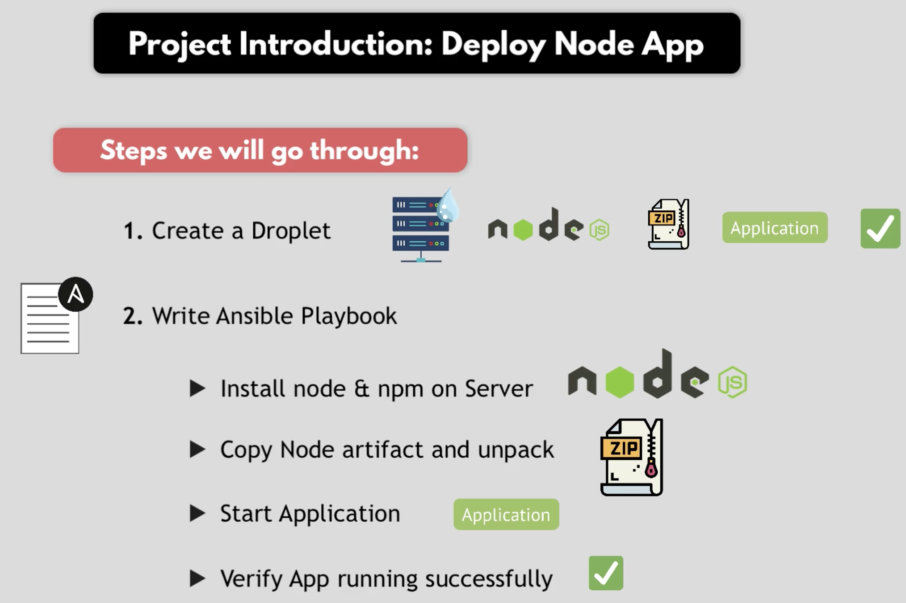
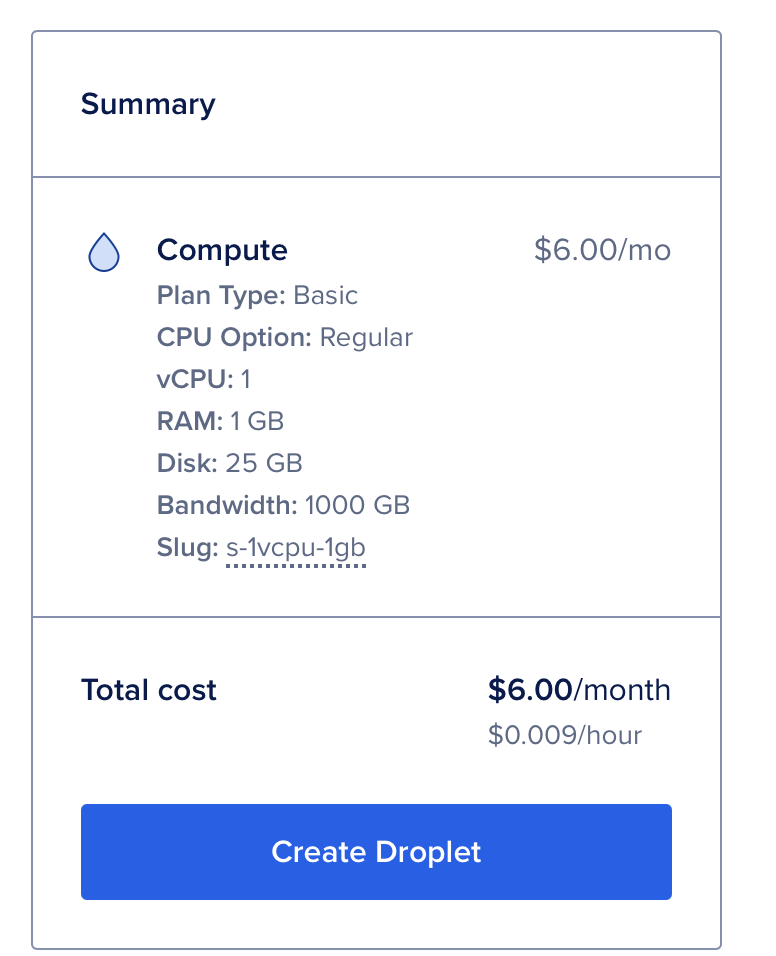
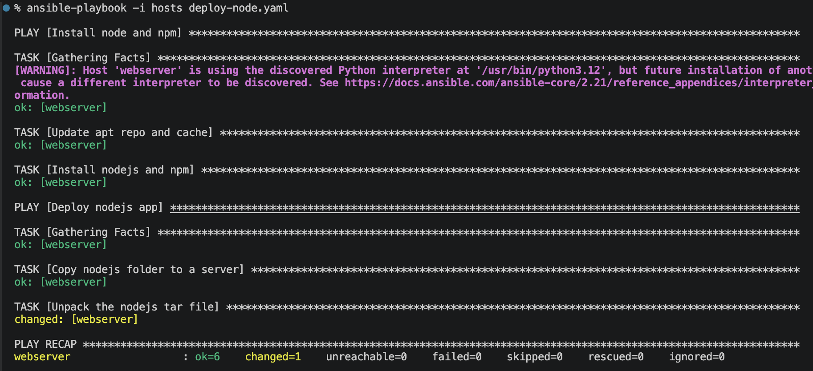
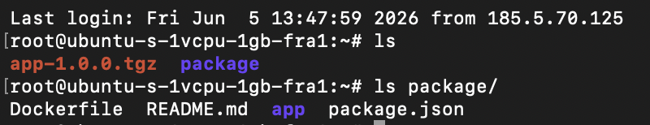
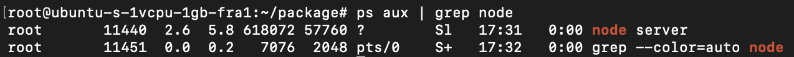
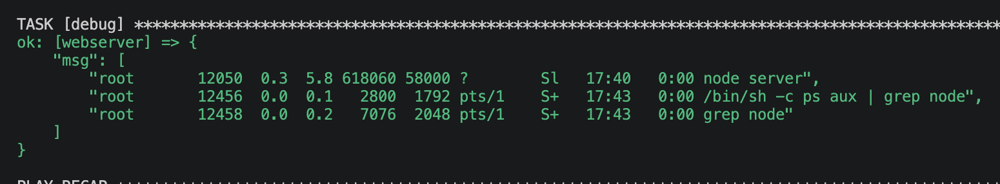
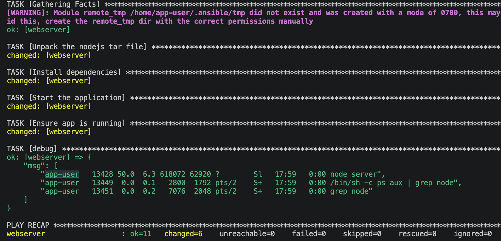

# Module 15 - Configuration Management with Ansible

This repository contains a demo project created as part of my **DevOps studies** in the [TechWorld with Nana – DevOps Bootcamp](https://www.techworld-with-nana.com/devops-bootcamp).

**Demo Project:** Automate Node.js application Deployment

**Technologies used:** Ansible, Node.js, DigitalOcean, Linux

**Project Description:**

- Create Server on DigitalOcean
- Write Ansible Playbook that installs necessary technologies, creates Linux user for an application and deploys a NodeJS application with that user

---

## Prerequisites

- Install Ansible

On macOS:
```sh
brew install ansible
```

Using python:
```sh
pip install ansible
```


---

### Overview




### Create Server on DigitalOcean

Droplet configuration:

CPU Option: Regular
vCPU: 1
RAM: 1 GB
Disk: 25 GB



> Python is required to be installed on the target server, Ubuntu already has Python installed

- Copy a public IP address of the new droplet


### Write Ansible Playbook that installs necessary technologies, creates Linux user for an application and deploys a NodeJS application with that user

- Create `hosts` file

```sh
cp hosts.example hosts
```

```conf
webserver ansible_host=<DROPLET-IP> ansible_user=root ansible_ssh_private_key_file=~/.ssh/id_rsa ansible_python_interpreter=/usr/bin/python3.12
```

- Configure `deploy-node.yaml` playbook

- Copy and unpack tar file

Go to `nodejs-app` directory

```sh
npm i
npm pack
```

Run
```sh
ansible-playbook -i hosts deploy-node.yaml
```



Check result on the server




- Start Node app


Command module: 
https://docs.ansible.com/projects/ansible/latest/collections/ansible/builtin/command_module.html#ansible-collections-ansible-builtin-command-module


Run
```sh
ansible-playbook -i hosts deploy-node.yaml
```

Check node status on the server
```sh
ps aux | grep node
```




- Create a new user

User name: `app-user`

Add user creation play:

```yaml
- name: Create new linux user for node app
  hosts: webserver
  tasks:
    - name: Create linux user
      user:
        name: app-user
        comment: App User
        group: admin
```

Add become params:

```yaml
- name: Deploy nodejs app
  hosts: webserver
  become: True
  become_user: app-user
```

Run
```sh
ansible-playbook -i hosts deploy-node.yaml
```



